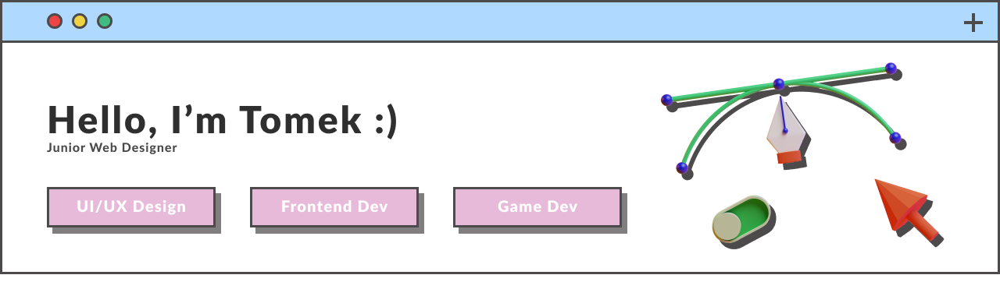

<h1 align="center">Hi 👋, I'm Tomek!</h1>
<h3 align="center">A computer science student from Poland.</h3>

- 🌱 I’m currently mastering my **React** skills 

- 📰  UI/UX Design, Frontend, Gamedev

- 📫 How to reach me **ttwitecki@gmail.com**

- 🔭 I’m currently working on **homework-project** 👇
- https://tomekswitecki.github.io/homework-project/#/landing

